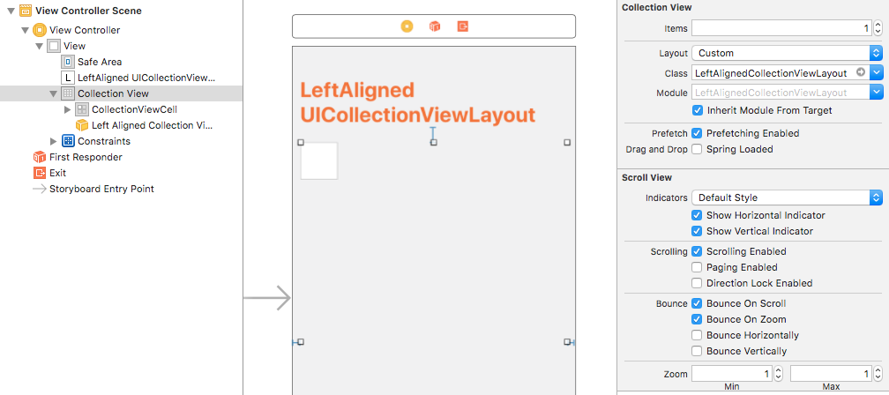

# LeftAlignedCollectionViewLayout

`LeftAlignedCollectionViewLayout` is a UICollectionViewFlowLayout implementation to left-align the content of a UICollectionView (similar to tagging interface usedin Facebook or Instagram).


# Installation

`LeftAlignedCollectionViewLayout` can be installed using CocoaPods.
```
platform :ios, '9.0'
pod 'LeftAlignedCollectionViewLayout'
```

# Usage

Start using `LeftAlignedCollectionViewLayout` by setting layout as custom in IB and setting LeftAlignedCollectionViewLayout as custom class (As shown in image)



# Usage

`LeftAlignedCollectionViewLayout` is released under [MIT](LICENSE.md) license.
